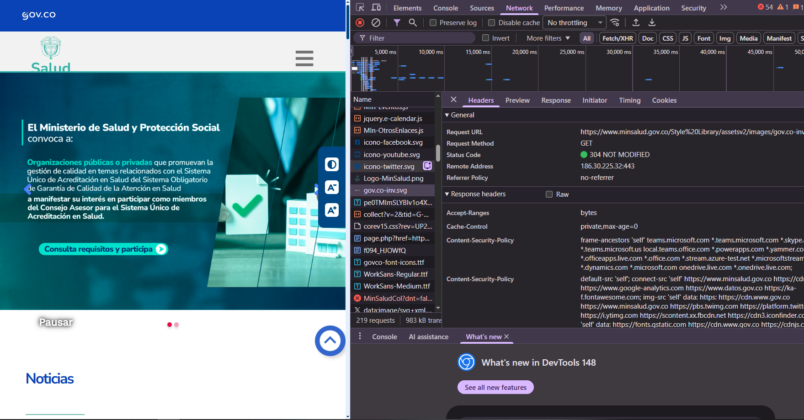
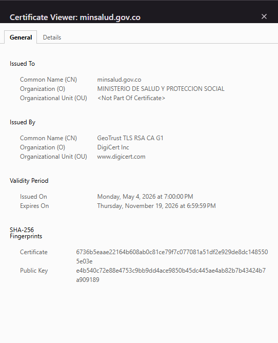
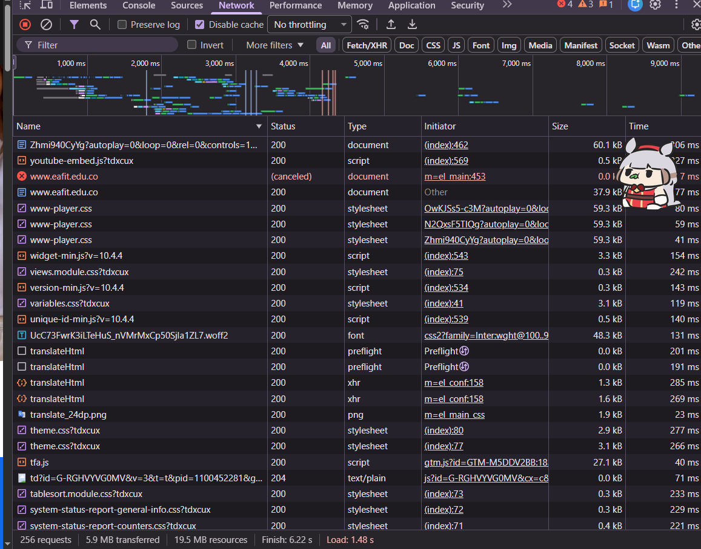
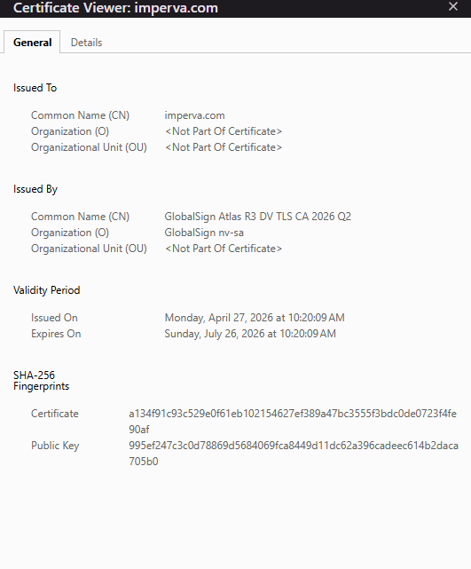
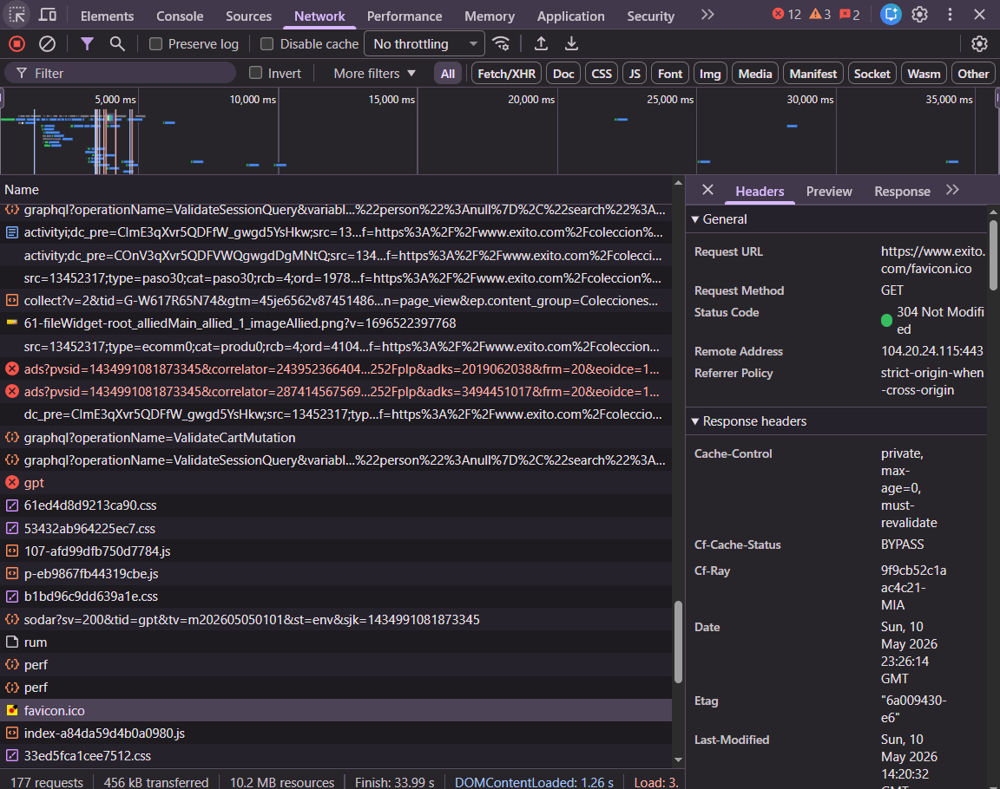
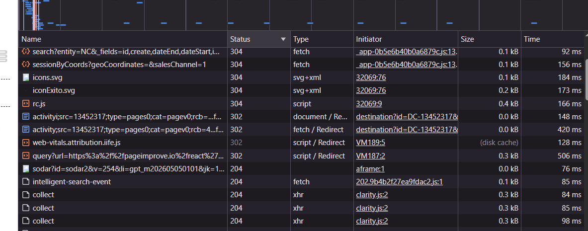

# Bitácora de inspección HTTP
* Nombre del estudiante:* <Camilo-Andres-Velasco-Saldarriaga>
* Programa académico:* <Ingenieria-de-software>
* Curso:* Lenguajes Web
* Semana:* Semana 1
* Fecha de elaboración:* <10/05/2026>
## 1. Sitio del Estado colombiano
### Datos generales
* URL analizada:*
<https://www.minsalud.gov.co/Paginas/InicioV2.aspx>
* Fecha y hora de observación:*
<10/05/2026> - <5:52pm>
* Código de estado del documento principal: 304 ok*
* TTFB:38.09 ms
* Tamaño total transferido:608kb
* Número total de peticiones: 218
No se observaron redirecciones 3xx relevantes durante la carga inicial.
* Autoridad emisora del certificado TLS:GeoTrust TLS RSA CA G1
* Fecha de expiración del certificado TLS: jueves, noviembre 19 2026 a las 6:59:59am
### Capturas

### Observaciones

## 2. Sitio universitario
### Datos generales
* URL analizada: https://www.eafit.edu.co/
* Fecha y hora de observación: 6:12 pm 5/10/2026
* Código de estado del documento principal: 200
* TTFB: 48.18 ms
* Tamaño total transferido:2.7mb
* Número total de peticiones:274
* Redirecciones 3xx observadas: no se observaron redirecciones 3xx relevantes
* Autoridad emisora del certificado TLS:GlobalSign atlas R3 DV TLS CA 2026  Q2
* Fecha de expiración del certificado TLS: domijngo jullio 26 2026 10:20:09 AM
### Capturas

### Observaciones
tiene muchos scripts
## 3. Sitio comercial colombiano
### Datos generales
* URL analizada:https://www.exito.com/coleccion/32069
* Fecha y hora de observación:6:26 PM 5/10/2026
* Código de estado del documento principal:304
* TTFB:74.84ms
* Tamaño total transferido:459kb
* Número total de peticiones:193
* Redirecciones 3xx observadas:No se observaron redirecciones 3xx relevantes.
* Autoridad emisora del certificado TLS: WE1
* Fecha de expiración del certificado TLS: sabado junio 20 2026 a las 9:04:26pm
### Capturas

### Observaciones
no tiene redirecciones

## Reflexión final
Escriba aquí un párrafo de mínimo 200 palabras en el que responda:
1. ¿Cuál de los tres sitios cargó más rápido y a qué se atribuye?
2. ¿Qué diferencias se observaron en el uso de redirecciones?
3. ¿Todos los certificados TLS son emitidos por la misma autoridad o varían?
La reflexión debe comparar los datos obtenidos, por ejemplo: TTFB, tamaño transferido, número de
peticiones, redirecciones y autoridad certificadora.

r//Al analizar los tres sitios web, el portal del Ministerio de Salud y Protección Social presentó el mejor rendimiento, con un TTFB de 38.09 ms. Este resultado se relaciona con el bajo volumen de datos transferidos, cercano a 608 kb, y una estructura aparentemente más optimizada, pese a realizar 218 peticiones. En segundo lugar se ubicó el sitio de la Universidad EAFIT, con un TTFB de 48.18 ms. Aunque mostró un desempeño aceptable, transfirió aproximadamente 2.7 MB y ejecutó 274 peticiones, evidenciando un mayor uso de recursos gráficos, scripts y componentes dinámicos que aumentan el peso y el tiempo de carga. Por su parte, el portal comercial de Éxito registró el TTFB más alto, con 74.84 ms, aun cuando solo transfirió 459 kb y realizó 193 peticiones. Esto puede explicarse por procesos adicionales asociados al comercio electrónico, como publicidad dinámica, validaciones y carga de catálogos. Además, no se identificaron redirecciones 3xx relevantes en ninguno de los casos, indicando configuraciones eficientes. Finalmente, cada sitio utilizó diferentes autoridades certificadoras TLS, reflejando distintas decisiones tecnológicas y de seguridad. Los resultados muestran cómo el tipo de contenido, la infraestructura implementada y la finalidad de cada portal influyen directamente en su desempeño y estabilidad
